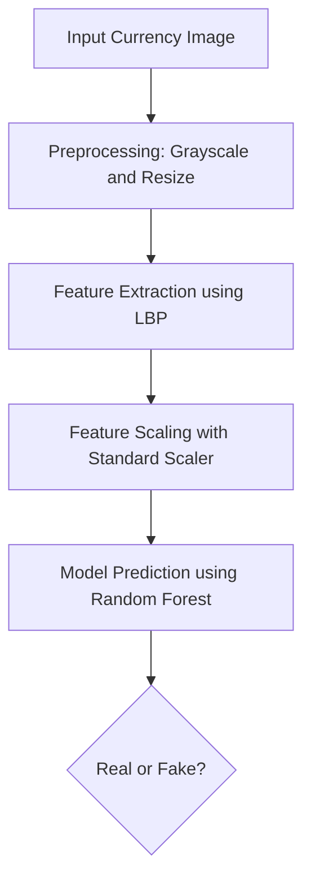

       

📊 Project Overview
A machine learning-based computer vision system for detecting counterfeit currency using Local Binary Pattern (LBP) feature extraction and Random Forest classification.

🎯 Performance Results
Model Evaluation
Overall Accuracy: 76.87%

ROC AUC Score: 0.861

Best Model: Random Forest Classifier

Dataset Statistics
Training Set: 2,774 images (1,387 Real + 1,387 Fake)

Testing Set: 562 images (265 Real + 297 Fake)

Feature Dimension: 17 LBP features

Random Forest Performance
text
Accuracy: 76.87%
ROC AUC: 0.861

Confusion Matrix:
[[211  54]
 [ 76 221]]

Real Currency:
- Precision: 0.74, Recall: 0.80, F1-Score: 0.76

Fake Currency:
- Precision: 0.80, Recall: 0.74, F1-Score: 0.77
🛠 Installation
bash
git clone https://github.com/Yokshith09/fake-currency-detection.git
cd fake-currency-detection
pip install opencv-python numpy pandas scikit-learn scikit-image matplotlib jupyter joblib tqdm
🚀 Usage
python
import joblib

# Load trained model
model = joblib.load('rf_currency_detector.pkl')
scaler = joblib.load('scaler_currency.pkl')

# Make predictions
features_scaled = scaler.transform(lbp_features)
prediction = model.predict(features_scaled)
probability = model.predict_proba(features_scaled)

### ⚙️ **Project Workflow**

⚙️ Features
LBP Feature Extraction: 17 texture features per image

Multiple Classifiers: Random Forest & SVM comparison

Balanced Dataset: Strategic class distribution

Fast Processing: ~26 images/second feature extraction

📄 License
MIT License
